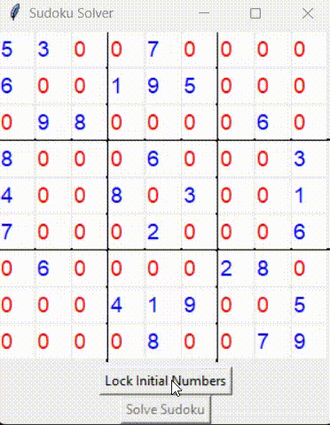
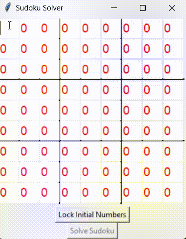
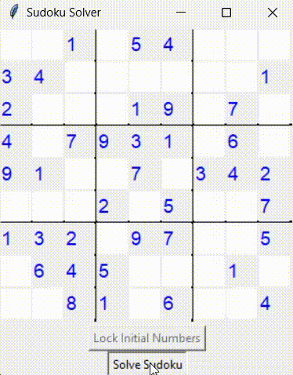

# SudokuSolver
Sudoku Solver with Backtracking Visualization

It provides functionalities to load Sudoku puzzles, manually fill in numbers, and visualize the backtracking search algorithm for educational purposes.

The solver includes a customizable timelaps parameter that allows users to control the speed of the backtracking visualization. By adjusting this parameter, users can slow down the visualization to clearly observe each step of the algorithm as it searches for the solution.

In addition to the interactive Python version, this project also includes a high-performance Sudoku solver written in C++. 

This version is designed for speed and does not include a visual component.
This solver implements the Minimum Remaining Values (MRV) heuristic, it chooses the cell with the fewest legal values left to fill in next. This strategy significantly reduces the search space.
